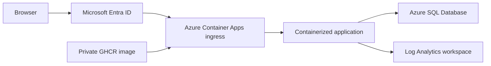

# Azure Container Apps migration knowledge share for Lucid Tenant CRM

This document captures the Portfolio Manager migration to Azure so the Lucid
Tenant CRM workspace can reuse the proven platform pattern. It describes the
shared infrastructure and deployment approach, not Portfolio Manager data or
credentials.

## What is already available

| Resource | Value | Lucid Tenant CRM use |
| --- | --- | --- |
| Azure subscription | `Lucido-Apps` | Deploy CRM resources here. |
| Resource group | `Lucido-Apps-RG` | Existing shared application resource group. |
| Container Apps environment | `lucido-apps-env` in `westus3` | Reuse this environment; do not create a second one. |
| Log Analytics workspace | `lucido-apps-logs` in `westus3` | Container Apps logs flow here. |
| Azure SQL logical server | `lucidpm-sql-24899.database.windows.net` | Existing server hosting TenantCRM and Portfolio Manager databases. |
| Container registry pattern | Private GitHub Container Registry (GHCR) | Publish a separate private CRM image and use a read-only package token for Azure pulls. |

Portfolio Manager currently runs as a public HTTPS Azure Container App in this
environment. It uses the temporary Azure hostname while custom-domain work is
deferred pending DNS access. Lucid Tenant CRM can follow the same path and add
its custom domain later without redeploying the application.

## Architecture that worked



The application is packaged with a `python:3.12-slim-bookworm` base image,
Microsoft ODBC Driver 18, locked Python dependencies, and a non-root runtime
user. Build artifacts, local databases, virtual environments, `.env` files,
keys, tests, and handoff documents are excluded with `.dockerignore`.

Use one image repository per application, for example
`ghcr.io/mslucido-lab/<crm-image>`. Keep it private. Azure Container Apps needs
a separate read-only GHCR token to pull new revisions; a developer publish token
must not be used as the registry credential in Azure.

## Deployment sequence

1. **Containerize locally.** Use a Dockerfile that installs ODBC Driver 18 and
   runs the existing WSGI entrypoint. Run the image locally against the Demo
   database first.
2. **Verify the local container.** Exercise login, dashboard, settings, PDF,
   import and undo workflows. Skip paid AI actions until a spend cap is set.
3. **Publish a versioned image.** Push both a fixed tag, such as `0.1.0`, and
   `latest` to private GHCR.
4. **Create the Container App internally first.** Set `min-replicas 1` while
   bootstrapping so `az containerapp exec` has a live replica to attach to.
5. **Store configuration as Container Apps secrets.** Pass passwords and app
   keys via `secretref:` environment variables. Never put values in source,
   command history, image layers, or deployment output.
6. **Run schema bootstrap explicitly.** Keep startup bootstrap disabled in the
   Container App and run it after schema-affecting deploys:

   ```powershell
   az containerapp exec --name <app-name> --resource-group Lucido-Apps-RG `
     --command "flask --app app bootstrap"
   ```

7. **Enable and test Microsoft Entra authentication while ingress is still
   restricted.** Only remove a temporary IP restriction after Entra sign-in and
   application-session behavior work.
8. **Scale down to zero after validation.** Configure an explicit HTTP scale
   rule and verify an idle replica list is empty before accepting the cold-start
   experience.

## Database and secrets pattern

- Create a dedicated contained Azure SQL user for the application. Grant only
  the roles required by that application; do not use an administrator account.
- If an application reads another database, use a distinct read-only contained
  user for that connection.
- Container Apps consumption egress IPs are not static. The current low-cost
  pattern permits Azure services at the SQL firewall and relies on SQL
  authentication. A future VNet and NAT gateway can narrow this further.
- Use a stable encryption key for already-encrypted application data. A key
  generated in a container filesystem is lost at restart and will not work
  across replicas. Store the stable value as a Container Apps secret instead.
- Set `PORTFOLIO_BOOTSTRAP_ON_START=0` or the CRM equivalent in Container Apps.
  Repeated DDL at scale-out increases cold-start time and can race across
  replicas.

## Microsoft Entra gate

Container Apps built-in authentication provides the perimeter before traffic
reaches the container. The successful implementation used:

- A **single-tenant** Entra application registration.
- A redirect URI of
  `https://<app-fqdn>/.auth/login/aad/callback`.
- **ID-token issuance enabled** on the app registration.
- A service principal created for the registration.
- Container Apps authentication enabled with
  `RedirectToLoginPage` and HTTPS required.
- A Container Apps-held client secret with a documented rotation date.

For a Flask application that has its own login screen, prevent a double login by
trusting `X-MS-CLIENT-PRINCIPAL-NAME` only when a Container-Apps-only environment
flag is set. The application must never trust that header in local or arbitrary
hosting environments, because Container Apps is what strips client-supplied
copies and injects the verified identity.

Route application logout through `/.auth/logout`. Do not redirect immediately
back to the protected application root, because Entra browser SSO can silently
sign the user straight back in. Let the platform show its signed-out page.

**Access assignment:** single-tenant prevents accounts outside the tenant from
signing in, but tenant membership can still be broader than intended. Before
making the CRM public, set the CRM enterprise application to require assignment
and assign only approved users or a dedicated group. Assign the administrator
first, then enable the requirement, to avoid locking out the person performing
the change.

## Scale-to-zero

The Container App uses `min-replicas 0`, `max-replicas 3`, and an explicit HTTP
scale rule. Azure’s default idle cooldown is five minutes. Verify scale-to-zero
with:

```powershell
az containerapp replica list --name <app-name> --resource-group Lucido-Apps-RG
```

After the list is empty, make one browser request and measure the user-visible
time to reach an authenticated dashboard. The initial page can appear quickly
while authentication waits on an Azure SQL connection or database resume. Decide
whether the latency is acceptable before committing to `min-replicas 0`; use
`min-replicas 1` only if the ongoing cost is justified.

## Required validation gates

Before public rollout, validate:

- Private GHCR image pull and a healthy Container App revision.
- Explicit schema bootstrap with no database errors.
- Microsoft Entra sign-in reaches the app without a second login.
- Logout reaches the platform signed-out page.
- Public access from a non-home network still requires Entra sign-in.
- Application workflows: dashboard, writes, PDFs/reports, imports and undo,
  Demo mode if applicable, and all cross-database calls.
- Graceful behavior when a dependent Azure SQL database is paused or unavailable.
- Scale-to-zero and a real user-visible cold start.
- `pytest -m "not integration"`, route-uniqueness checks, Ruff, and
  `git diff --check` before commit.

For AI-backed features, set the provider spend cap before the first cloud call.
Perform one controlled production validation after rollout and record the result.

## Problems encountered and fixes

| Problem | Fix |
| --- | --- |
| Docker Desktop was installed but its engine was not running. | Start Docker Desktop; a user-installed Linux WSL distribution is not required for Docker Desktop. |
| Container ran as non-root but `/app` was root-owned. | `chown` the application directory before switching users; compile bytecode during the image build. |
| Encryption key was omitted from the image. | Read a stable key from a Container Apps secret; do not generate it in the container. |
| First Entra callback returned HTTP 401. | Enable ID-token issuance and create the app registration’s service principal. |
| Entra sign-in was followed by the app login screen. | Gate trusted principal-header handling with a Container-Apps-only environment flag. |
| Logout went immediately back to the dashboard. | Send logout to `/.auth/logout` without redirecting straight to the protected root. |
| `min-replicas 0` did not visibly stop the app. | Add an explicit HTTP scale rule, then allow the full idle cooldown before checking replicas. |
| `az sql db pause` was unavailable. | Azure SQL serverless pauses through its idle configuration; observe the paused state rather than trying to force it with a nonexistent CLI command. |

## Follow-up work

- Add the CRM custom domain and Azure-managed certificate once DNS records can
  be managed.
- Consider a VNet/NAT design when stricter SQL firewall controls justify its
  cost and complexity.
- Use a durable storage strategy for any backup artifacts that must survive
  container restarts.
- Record Entra client-secret expiry and GHCR pull-token expiry in an operational
  reminder system.
